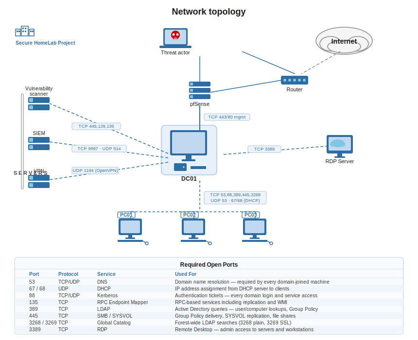
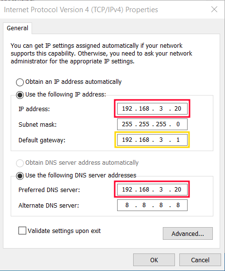
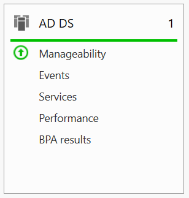
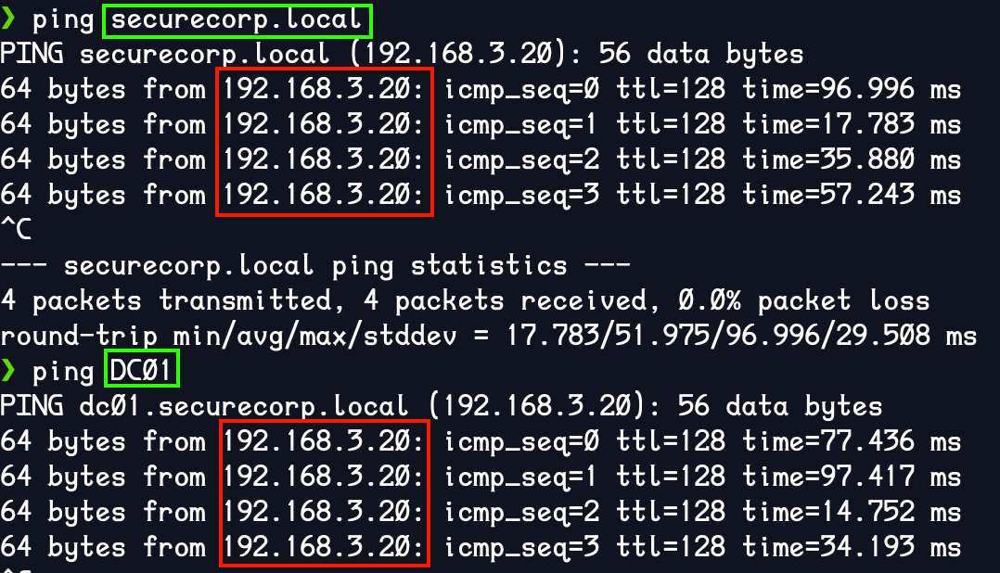
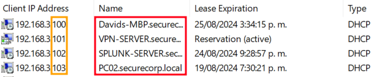
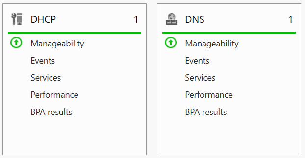
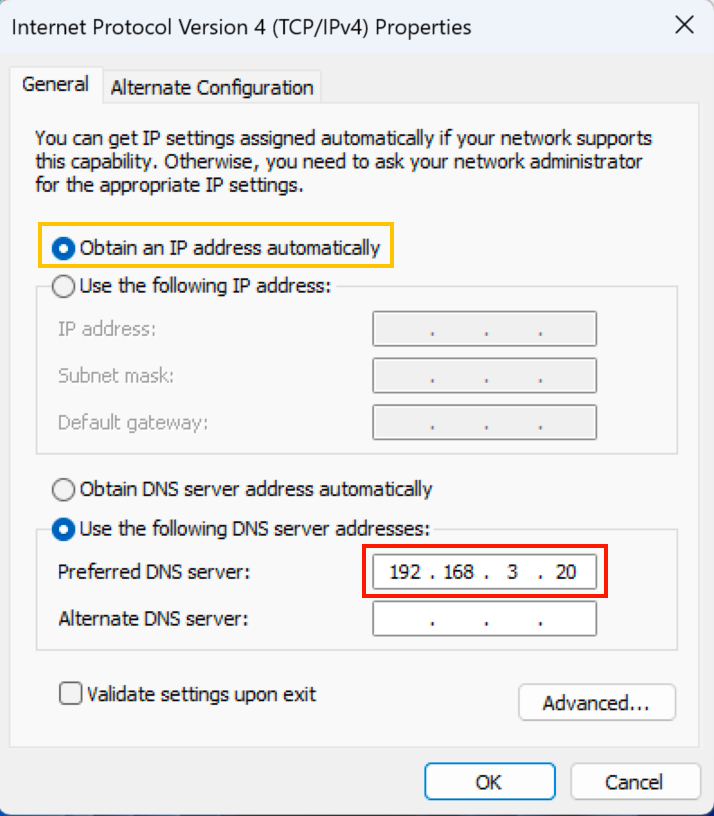
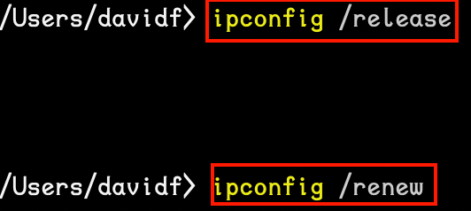
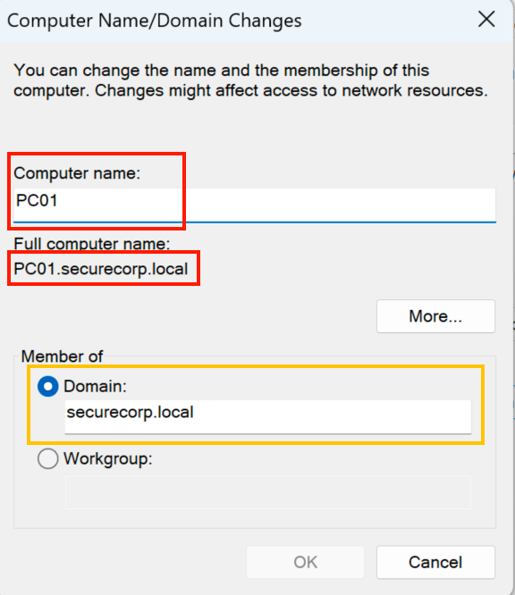
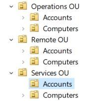

# Active Directory Lab — Dual Domain Controller with DHCP (Redundancy Build)

   

This guide documents the complete build of an enterprise-style Active Directory lab using two Windows Server 2022 Domain Controllers for redundancy, plus a dedicated member server running DHCP. Every step mirrors real production environments — dual DC promotion, site-aware replication, DNS high-availability, and DHCP authorization through AD.



---

## Lab Architecture

| Server | Role | IP |
|---|---|---|
| CORP-DC01 | Primary DC, DNS, Global Catalog | 10.50.0.10 |
| CORP-DC02 | Secondary DC, DNS, Global Catalog | 10.50.0.11 |
| CORP-MEMBER01 | DHCP, File Server, PKI, NPS | 10.50.0.20 |

```
Domain:   corp.example.com
NetBIOS:  CORP
Subnet:   10.50.0.0/24
VirtualBox Adapter 1: Host-Only (domain LAN)
VirtualBox Adapter 2: NAT (internet/updates)
```

**Why two DCs?** A single Domain Controller is a single point of failure. If DC01 goes down, authentication, DNS, and Group Policy all stop. DC02 acts as a replica — it holds a full copy of AD, runs its own DNS, and takes over automatically when DC01 is offline.

---

## Network Topology

The lab replicates a real enterprise perimeter:

- **pfSense** — firewall/router separating the lab LAN from the internet
- **DC01 / DC02** — domain controllers providing authentication, DNS, and Group Policy to all domain members
- **CORP-MEMBER01** — infrastructure server (DHCP, file shares, PKI, NPS)
- **Workstations (PC01–PC03)** — domain-joined clients
- **Security servers** — SIEM (Splunk), vulnerability scanner (Nessus), VPN


---

## Phase 1: VirtualBox Network Setup

Before building any VMs, configure the Host-Only network in VirtualBox so all machines share the same LAN:

```
VirtualBox → Tools → Network → Host-only Networks
Create: vboxnet0
  IP:   10.50.0.1
  Mask: 255.255.255.0
  DHCP: DISABLED  ← critical; your DC will be the DHCP server
```

For **every VM** in this lab:
- Adapter 1: Host-only `vboxnet0` (domain LAN)
- Adapter 2: NAT (internet access for Windows Updates)

> Do not enable VirtualBox's built-in DHCP on this network — the domain DHCP server must be the only one assigning addresses, or you'll get IP conflicts and failed domain joins.

---

## Phase 2: Build the VM Hardware

Create two identical VMs for the DCs:

| Setting | Value |
|---|---|
| OS | Windows Server 2022 Datacenter Evaluation |
| vCPU | 2 |
| RAM | 6–8 GB |
| Disk | 80 GB |
| Network | Adapter 1: Host-only / Adapter 2: NAT |

Rename the VMs during Windows Setup or immediately after first login:
- `CORP-DC01`
- `CORP-DC02`

---

## Phase 3: Configure Static IPs

Static IPs are mandatory for Domain Controllers. If a DC's IP changes, DNS breaks, domain joins fail, and replication stops.

**On CORP-DC01:**

Open: `Control Panel → Network → Network Connections → NIC Properties → IPv4`

| Field | Value |
|---|---|
| IP Address | 10.50.0.10 |
| Subnet Mask | 255.255.255.0 |
| Default Gateway | 10.50.0.1 (or blank) |
| Preferred DNS | 10.50.0.10 (itself) |
| Alternate DNS | (blank for now) |



**On CORP-DC02:**

| Field | Value |
|---|---|
| IP Address | 10.50.0.11 |
| Subnet Mask | 255.255.255.0 |
| Preferred DNS | 10.50.0.10 (DC01 first — DC02 does not have DNS yet) |
| Alternate DNS | (blank for now) |

> DC02's DNS points to DC01 during the join phase. After DC02 is promoted, you update both NICs for mutual redundancy.

Reboot both machines after renaming and setting IPs.

---

## Phase 4: Promote DC01 — Create the Forest

On **CORP-DC01**, open PowerShell as Administrator.

**Step 1 — Install the AD DS and DNS roles:**

```powershell
Install-WindowsFeature AD-Domain-Services, DNS -IncludeManagementTools
```

After installation, Server Manager shows the AD DS tile:



**Step 2 — Create the forest:**

```powershell
Install-ADDSForest `
  -DomainName "corp.example.com" `
  -DomainNetbiosName "CORP" `
  -InstallDNS `
  -SafeModeAdministratorPassword (Read-Host -AsSecureString) `
  -Force
```

When prompted, enter a strong DSRM (Directory Services Restore Mode) password and store it somewhere safe — it's the recovery password used if AD itself breaks.

The server will reboot automatically. After reboot, log in as `CORP\Administrator`.

---

## Phase 5: Post-Promotion Tasks on DC01

### Enable AD Recycle Bin

The Recycle Bin lets you recover accidentally deleted AD objects (users, computers, OUs) without restoring from backup. Enable it immediately — it cannot be turned on retroactively after objects are deleted.

```powershell
Enable-ADOptionalFeature 'Recycle Bin Feature' `
  -Scope ForestOrConfigurationSet `
  -Target "corp.example.com"
```

### Create Enterprise OU Structure

Organize your domain from the start using a tiered model that mirrors real enterprise environments:

```
CORP
├── Tier0
│   ├── Domain Controllers
│   └── Admin Accounts         ← DC/forest admins only
├── Tier1
│   ├── Servers
│   └── Server Admins          ← server admins, no DC access
├── Tier2
│   ├── Workstations
│   └── Users                  ← standard users, no server access
├── Groups
└── Service Accounts
```

Move DC01's computer object into `Tier0\Domain Controllers`.

### Verify DNS is Working

From another machine on the network, ping the domain name and the DC hostname:

```cmd
ping corp.example.com
ping CORP-DC01
nslookup corp.example.com
```



Both should resolve to `10.50.0.10`. If `nslookup` returns the correct IP, DNS is functional.

---

## Phase 6: Join DC02 to the Domain

Before promoting DC02, it must first join the domain as a regular member server.

### Step 1 — Set DNS on DC02

DC02 must use DC01's IP as its DNS server so it can resolve the domain name:

Open: `Control Panel → Network → NIC Properties → IPv4`
- Preferred DNS: `10.50.0.10`
- Alternate DNS: (leave blank)

### Step 2 — Verify Connectivity

```cmd
ping 10.50.0.10
nslookup corp.example.com
```

Both must succeed before attempting the domain join.

### Step 3 — Join the Domain

```
Right-click Start → System → Rename this PC (Advanced)
→ Computer Name tab → Change
→ Select: Domain
→ Enter: corp.example.com
→ Credentials: CORP\Administrator + password
```

You should see: **Welcome to the corp.example.com domain**

### Step 4 — Reboot and Verify

After reboot, log in as `CORP\Administrator` and confirm:

```cmd
whoami
# Should show: corp\administrator

systeminfo | findstr /i "domain"
# Should show: Domain: corp.example.com
```

---

## Phase 7: Promote DC02 — Add Replica Domain Controller

This is the critical step that creates your redundancy. DC02 will replicate all of AD — users, computers, policies, DNS zones — from DC01 and remain in sync continuously.

**On CORP-DC02**, open PowerShell as Administrator:

**Step 1 — Install AD DS:**

```powershell
Install-WindowsFeature AD-Domain-Services, DNS -IncludeManagementTools
```

**Step 2 — Promote as replica DC:**

```powershell
Install-ADDSDomainController `
  -DomainName "corp.example.com" `
  -InstallDNS `
  -Credential (Get-Credential) `
  -SafeModeAdministratorPassword (Read-Host -AsSecureString) `
  -Force
```

When prompted for credentials, enter `CORP\Administrator` and the domain admin password.

The server reboots. After reboot, it is a full Domain Controller with a replica of Active Directory.

> **USN Rollback Warning:** Never revert a DC VM snapshot after promotion. VirtualBox snapshots roll back the USN (Update Sequence Number) counter, which tells other DCs that this DC has "rewound" in time. Other DCs reject its replication and the domain breaks. If you need snapshots, take them before promotion only.

---

## Phase 8: Fix DNS for Mutual Redundancy

Now that both DCs are promoted and running DNS, update both NICs so each DC points to itself first and the other DC as backup:

**On CORP-DC01 NIC:**
- Preferred DNS: `10.50.0.10` (itself)
- Alternate DNS: `10.50.0.11` (DC02)

**On CORP-DC02 NIC:**
- Preferred DNS: `10.50.0.11` (itself)
- Alternate DNS: `10.50.0.10` (DC01)

This means: if DC01 goes down, DC02 can still resolve DNS for the entire domain — and vice versa. Domain clients, servers, and workstations keep working.

---

## Phase 9: Build CORP-MEMBER01 and Configure DHCP

**Why put DHCP on a member server, not a DC?** Microsoft recommends separating the DHCP role from Domain Controllers in production. DCs should focus on authentication and replication; putting DHCP on a DC means a DC restart takes down DHCP. A dedicated member server keeps the roles independent.

### Build MEMBER01 VM

| Setting | Value |
|---|---|
| Name | CORP-MEMBER01 |
| IP | 10.50.0.20 |
| Preferred DNS | 10.50.0.10 |
| Alternate DNS | 10.50.0.11 |

Set the static IP, join the domain (`corp.example.com`), and reboot. Move the computer object to `Tier1\Servers` in AD.

### Install DHCP Role

```powershell
Install-WindowsFeature DHCP, FS-FileServer -IncludeManagementTools
```

Or via Server Manager: **Add Roles and Features → DHCP Server → File and Storage Services → File Server**

### Authorize DHCP in Active Directory

DHCP servers must be authorized in AD before they can issue leases. This prevents rogue DHCP servers from accidentally handing out wrong IPs on your domain.

**Via PowerShell:**
```powershell
Add-DhcpServerInDC -DnsName "CORP-MEMBER01.corp.example.com" -IpAddress 10.50.0.20
```

**Via GUI:**
1. Open `Server Manager → Tools → DHCP`
2. Right-click `CORP-MEMBER01` → **Authorize**
3. Wait 10–20 seconds, then right-click → **Refresh**
4. The red arrow on IPv4 should disappear

### Create the DHCP Scope

**Via PowerShell:**
```powershell
Add-DhcpServerv4Scope `
  -Name "Corp Scope" `
  -StartRange 10.50.0.100 `
  -EndRange 10.50.0.200 `
  -SubnetMask 255.255.255.0

Set-DhcpServerv4OptionValue `
  -DnsDomain corp.example.com `
  -DnsServer 10.50.0.10, 10.50.0.11 `
  -Router 10.50.0.1
```

**Via GUI:**
1. `DHCP console → IPv4 → right-click → New Scope`
2. Name: `Corp Scope`
3. Start IP: `10.50.0.100` / End IP: `10.50.0.200`
4. Subnet mask: `255.255.255.0`
5. Router: `10.50.0.1`
6. DNS Servers: `10.50.0.10`, `10.50.0.11` (remove any 8.8.8.8 entries)
7. Domain Name: `corp.example.com`
8. Activate scope: **Yes**

### Verify DHCP is Issuing Leases

After connecting a client to DHCP, the console shows active leases:



DHCP and DNS both show healthy (green up arrow) in Server Manager:



### Test from a Client Workstation

Set the client NIC to obtain an IP automatically, point DNS at the DC:



Then renew the lease:

```cmd
ipconfig /release
ipconfig /renew
ipconfig
```



The client should receive an IP in the `10.50.0.100–200` range with DNS pointing to both DCs.

---

## Phase 10: Join Workstations to the Domain

From each workstation:

```
Right-click Start → System → Rename this PC (Advanced)
→ Computer Name tab → Change → Domain: corp.example.com
→ Credentials: CORP\Administrator
→ Reboot
```

After reboot, log in as a domain user (`CORP\username`).

Domain and computer name settings from a joined client:



> All VMs must use **Bridged Adapter** or **Host-Only** networking — not NAT only. NAT isolates each VM behind its own private NAT address; they cannot reach each other or the domain. Bridged or Host-Only puts them all on the same network segment.

---

## Phase 11: Configure AD Sites and Services

Sites and Services controls how replication traffic flows between DCs. Without configuration, AD uses defaults that may not reflect your actual network topology.

On DC01: `Start → Windows Administrative Tools → Active Directory Sites and Services`

1. Rename `Default-First-Site-Name` → `HQ`
2. Confirm both DC01 and DC02 appear under `HQ`
3. Add subnet: right-click `Subnets` → New Subnet → `10.50.0.0/24` → assign to `HQ`

In a real enterprise, Sites and Services determines which DC a client contacts for logon (closest DC by site) and controls inter-site replication schedules.

---

## Phase 12: Build the OU Structure in AD

Organizational Units (OUs) let you apply different Group Policies to different parts of the organization and delegate admin rights at granular levels.



Example structure for this lab:

| OU | Purpose |
|---|---|
| `Tier0\Domain Controllers` | DC computer objects |
| `Tier0\Admin Accounts` | Domain/forest-level admin accounts |
| `Tier1\Servers` | Member server computer objects |
| `Tier1\Server Admins` | Server-tier admin accounts |
| `Tier2\Workstations` | Domain workstation computer objects |
| `Tier2\Users` | Standard user accounts |
| `Groups` | Security and distribution groups |
| `Service Accounts` | Service principals |

---

## Phase 13: Health Validation

Run these checks after both DCs are promoted. This is what real admins run after building or modifying a domain — they're also the first thing support engineers ask for during incident response.

```powershell
# Check DC health — runs 30+ tests on replication, DNS, services, SYSVOL
dcdiag /v

# Check replication status between all DCs
repadmin /replsummary

# List all DCs in the domain
nltest /dclist:corp.example.com

# Verify the PDC emulator and other FSMO roles
netdom query fsmo
```

All `dcdiag` tests should pass. `repadmin /replsummary` should show 0 failures. If you see replication errors, run `repadmin /showrepl` for detail on which naming context is failing and which DC is the source.

---

## Phase 14: Test Redundancy (the Real Proof)

**Shut down CORP-DC01.**

From DC02 or a domain-joined workstation:

```cmd
nltest /dsgetdc:corp.example.com
```

It should return DC02's name and IP. Then try:

```cmd
gpupdate /force
net use \\CORP-DC02\SYSVOL
```

Log in using a domain user account — it should succeed, served entirely by DC02. This is the actual test that matters: not whether both DCs exist, but whether the domain continues to function when one is offline.

**Bring DC01 back online** and verify replication catches up:

```powershell
repadmin /replsummary
```

Any changes made to AD while DC01 was offline should now replicate back.

---

## Enterprise Hardening Checklist

After the core build is complete, these are the first hardening steps for a real environment:

| Task | Why It Matters |
|---|---|
| Deploy Windows LAPS | Randomizes local Administrator passwords per machine — prevents lateral movement when one machine is compromised |
| Disable SMBv1 | SMBv1 is the protocol exploited by EternalBlue / WannaCry; no modern Windows needs it |
| Tiered admin accounts | Separate accounts for DC admin (Tier0), server admin (Tier1), workstation admin (Tier2) — breach of a Tier2 account cannot escalate to DCs |
| Enable LDAP signing and channel binding | Prevents LDAP relay attacks against the DC |
| Advanced audit policy via GPO | Logs process creation (Event 4688), logon events (4624/4625), privilege use — required for SIEM/threat hunting |
| Restrict RDP access | Only named admin accounts should be in the Remote Desktop Users group on each machine |
| Apply DISA STIG GPOs | Bulk import the DISA Windows Server 2022 STIG GPO package and measure compliance with SCC — see the [STIG hardening repo](https://github.com/Louiethebean/STIG-GPO-SCC-Hardening) |

---

## What I Learned / Skills Demonstrated

**Active Directory architecture**
- How Domain Controllers replicate via DRSUAPI — every change gets a USN, DCs exchange changes on a pull model, and the KCC (Knowledge Consistency Checker) automatically builds the replication topology. Understanding this is why snapshot rollback destroys a domain.
- FSMO roles (PDC Emulator, RID Master, Infrastructure Master, Domain Naming Master, Schema Master) — DC01 holds all five by default; in a two-DC lab you can leave them there, but in production you distribute them and plan for FSMO seizure if the holder goes down.
- Why the domain name matters: `.local` is technically deprecated and causes mDNS conflicts with modern macOS and Linux. Using a proper subdomain (`corp.example.com`) avoids split-brain DNS issues in hybrid/cloud environments.

**DNS in Active Directory**
- AD DNS is not optional. Domain clients must resolve `_ldap._tcp.dc._msdcs.corp.example.com` SRV records to find DCs. If DNS breaks, the domain stops working even if every DC is online.
- Why each DC points to itself first, then the other DC — a DC that uses another DC for DNS creates a circular dependency on boot; pointing to itself lets it start DNS before trying to contact the other DC.

**DHCP authorization and redundancy**
- DHCP authorization in AD is a domain-wide security control: only authorized servers issue leases. This prevents rogue DHCP servers (a common misconfiguration or attack vector) from redirecting DNS and gateway traffic.
- Separating DHCP from DCs follows the principle of role separation — a DHCP service restart should not touch authentication.

**Redundancy that actually works**
- Having two DCs is only redundant if DNS is also redundant. If both DCs exist but clients only have one DC's IP as their DNS server, a DC failure still breaks name resolution. The dual-DNS NIC configuration is what makes failover transparent.
- The `nltest /dsgetdc` test with DC01 offline is the proof — not whether the server is running, but whether users can still authenticate.

**Problem solved:** built a two-DC Active Directory forest from scratch — forest creation, replica promotion, DNS mutual redundancy, DHCP authorization on a member server, OU structure, and AD Sites and Services — and verified redundancy by shutting down DC01 and confirming domain authentication continued from DC02.

---

## License

MIT License. See [LICENSE](./LICENSE) for details.
